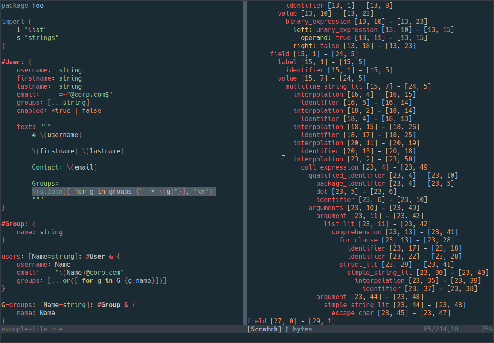

# tree-sitter-cue

[](https://github.com/eonpatapon/tree-sitter-cue/actions/workflows/ci.yml)
[](https://discord.gg/w7nTvsVJhm)

[Cue][] grammar for [tree-sitter][].



## Setup in Neovim

Using [lazy.nvim](https://github.com/folke/lazy.nvim)

```lua

return {
  "nvim-treesitter/nvim-treesitter",
  build = ":TSUpdate",
  event = { "BufReadPost", "BufNewFile" },
  --- @type TSConfig
  opts = {
    ensure_installed = {
      "cue",
    },
  },
  ---@param opts TSConfig
    config = function(_, opts)
      require("nvim-treesitter.configs").setup(opts)
    end,
}
```

[tree-sitter]: https://github.com/tree-sitter/tree-sitter
[cue]: https://github.com/cue-lang/cue
