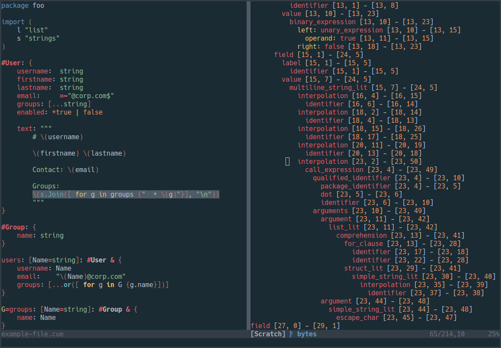

# tree-sitter-cue

[](https://github.com/eonpatapon/tree-sitter-cue/actions/workflows/ci.yml)
[](https://discord.gg/w7nTvsVJhm)

[Cue][] grammar for [tree-sitter][].



## Development

This project uses [Nix flakes](https://nixos.wiki/wiki/Flakes) to provide a
reproducible development environment with `tree-sitter`, `node`, `bc`, and
`python3`. You need Nix with `flakes` and `nix-command` experimental features
enabled (see [Nix flakes - Enable flakes](https://nixos.wiki/wiki/Flakes#Enable_flakes)).

```sh
nix develop
npm install
```

After modifying `grammar.js`, regenerate the parser and run tests:

```sh
tree-sitter generate
tree-sitter test
```

## Testing

```sh
# Run all tests (corpus tests + parse real CUE files)
npm test

# Run only tree-sitter corpus tests
tree-sitter test

# Parse example CUE files from cue-lang/cue
script/parse-examples

# Lint grammar.js
npm run lint
```

## Editor Setup

### Neovim

Using [lazy.nvim](https://github.com/folke/lazy.nvim)

```lua

return {
  "nvim-treesitter/nvim-treesitter",
  build = ":TSUpdate",
  event = { "BufReadPost", "BufNewFile" },
  --- @type TSConfig
  opts = {
    ensure_installed = {
      "cue",
    },
  },
  ---@param opts TSConfig
    config = function(_, opts)
      require("nvim-treesitter.configs").setup(opts)
    end,
}
```

[tree-sitter]: https://github.com/tree-sitter/tree-sitter
[cue]: https://github.com/cue-lang/cue
